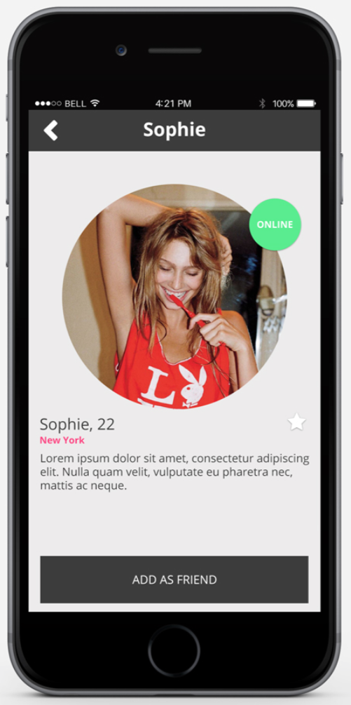
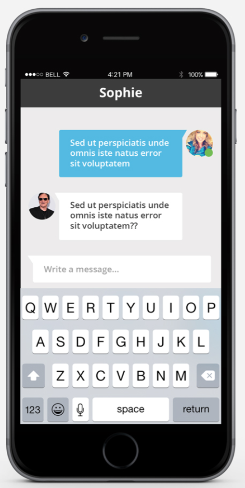

# Overview
We would like you to write a mobile­based web app without any backend. Below is the user story, followed by the design.

# Acceptance Criteria

## Profile page:
- When the app opens, the profile should be displayed.
- When the user clicks the "add as friend" button, the site background and button colors
should change (to the colors of your choice). When clicked for a second time, the
original colors should return.
- When a user clicks on a profile image on the home page, the chat page should open.

## Chat page:
- When the chat is opened, a random message from the other user should appear.
- Users should be able to send messages from the chat window.
- The message history should remain in the chat window for the duration of the session,
even if the user returns to the home page.
- When the user clicks the avatar on the chat page, or the back button, he should go to
the profile page.

## Other:
- Libraries are ok, but please don't use any frameworks (angular, ember, react)
- Please don't use any automatic code generation
- Closing the app window should close the session.
- Remember this is a mobile­based web­app, so we would like to be compatible with major
browsers (Safari, Chrome, Firefox, Opera).
- Please provide a short summary detailing anything you think is relevant, for _example_:
  - Installation steps
  - How to run your code / tests
  - Where to find your code
  - What would you have done differently if you had had more time
  - Etc.
- Please send your results as a [git bundle](https://git-scm.com/docs/git-bundle).

# Profile Page


# Chat Page


