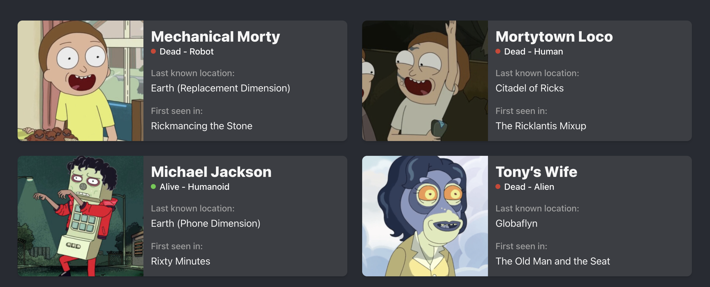

# General


We need a cool application using this great API https://rickandmortyapi.com/ and we would like to have a backend and frontend written in JS to play with it.

We need certain functionalities such as login, register, 404 page, list of characters, detail view and more, feel free to add new cool stuff.

# Evaluation
When evaluating your test, the following things are especially important to us:

How did you organize your files?
Did you use any module bundler?
Did you meet all of the functional requirements?
Did you add any tests?
...
